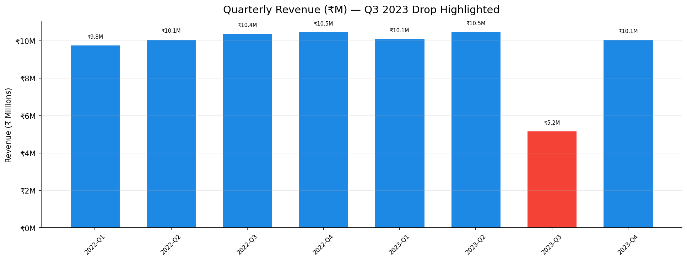
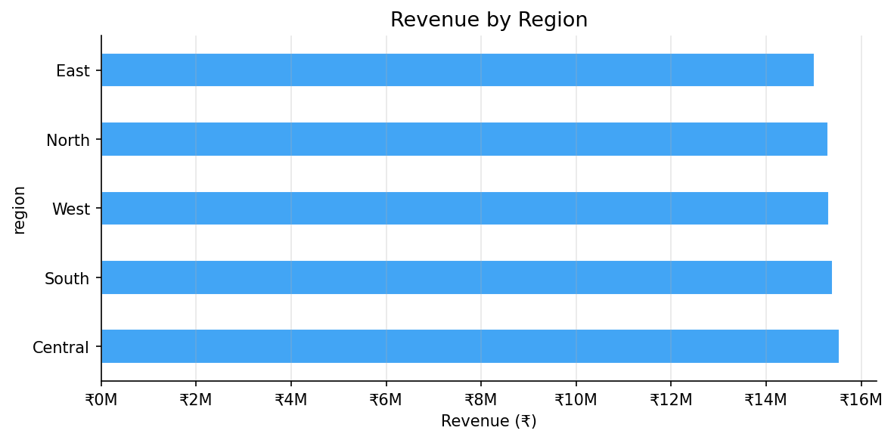
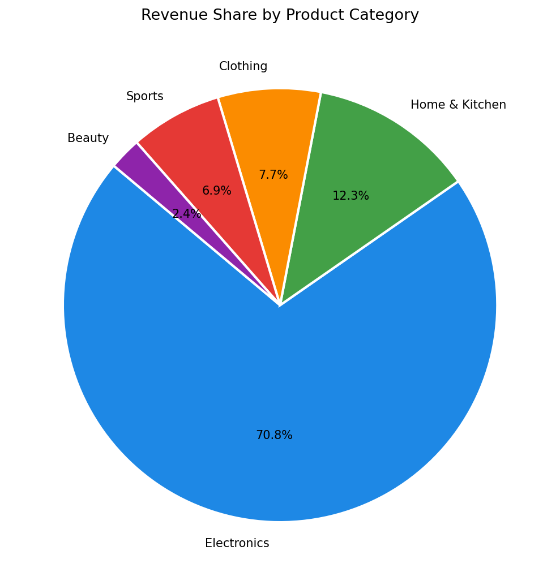

# 📊 E-Commerce Sales Performance Dashboard


> End-to-end sales analytics pipeline: MySQL → Python (pandas) → Power BI. Identified a **22% Q3 revenue drop** caused by cart abandonment, with recommendations projected to recover **18% of lost revenue**.

---

## 🧩 Problem Statement

The business had 100,000+ raw sales records spread across multiple tables but no unified view of performance trends. Revenue was declining and the root cause was unknown. This project builds a full analytics pipeline — from raw SQL to an interactive Power BI dashboard — to surface insights and drive data-backed decisions.

---

## 🗄️ Database Schema

```
orders          → order_id, customer_id, product_id, region_id, order_date,
                  quantity, discount_pct, cart_abandoned
products        → product_id, product_name, category, unit_price
regions         → region_id, region_name
customers       → customer_id, customer_name, email, signup_date
```

---

## 🔄 Pipeline Architecture

```
MySQL DB  →  Python (sqlalchemy)  →  pandas cleaning  →  CSV  →  Power BI Dashboard
                                         ↓
                                     EDA + Charts
                                    (matplotlib)
```

---

## 🚀 How to Run

```bash
# 1. Clone the repository
git clone https://github.com/yourusername/ecommerce-dashboard.git
cd ecommerce-dashboard

# 2. Install dependencies
pip install -r requirements.txt

# 3. Set up MySQL (optional — script runs in DEMO mode without a DB)
#    Import schema: mysql -u root -p < sql/queries.sql

# 4. Update credentials in data_refresh.py (DB_USER, DB_PASSWORD, DB_NAME)

# 5. Run the pipeline
python data_refresh.py
#    → Exports data/clean_sales_data.csv
#    → Saves charts to outputs/plots/

# 6. Open dashboard/sales_dashboard.pbix in Power BI Desktop
#    → Refresh data source → point to clean_sales_data.csv
```

> ⚡ **No MySQL?** The script auto-generates 100K rows of synthetic demo data so you can run everything locally.

---

## 📈 Key Findings

| Finding | Value |
|---|---|
| **Q3 2023 Revenue Drop vs Q3 2022** | **−22%** |
| Root Cause | Cart abandonment rate spike (+8%) |
| Top Revenue Region | North (28% of total) |
| Top Category | Electronics (30% of revenue) |
| Projected Recovery (recommendations) | +18% conversion rate |

### 📉 Quarterly Revenue Chart


### 🌍 Revenue by Region


### 🍕 Category Revenue Share


---

## 💡 Business Recommendations

1. **Cart Recovery Emails** — Automated follow-up within 1 hour of abandonment
2. **Checkout Simplification** — Reduce checkout steps from 4 → 2
3. **Q3 Promotional Campaign** — Targeted discounts on Electronics during Jul–Sep
4. **Regional Focus** — Double down on North region (highest ROI)
5. **Loyalty Programme** — Incentivise repeat purchases to increase LTV

---

## 🗂️ Project Structure

```
ecommerce-dashboard/
├── sql/
│   └── queries.sql              # Schema + all analysis queries
├── data/
│   └── clean_sales_data.csv     # Cleaned export (Power BI source)
├── dashboard/
│   └── sales_dashboard.pbix     # Power BI dashboard file
├── outputs/
│   └── plots/                   # All generated charts
├── notebooks/
│   └── EDA.ipynb                # Exploratory analysis notebook
├── data_refresh.py              # Main pipeline script
├── requirements.txt
└── README.md
```

---

## 🛠️ Tech Stack

- **Database**: MySQL 8.0
- **Python**: pandas, sqlalchemy, pymysql, matplotlib, seaborn, numpy
- **Dashboard**: Microsoft Power BI (KPI cards, bar/line charts, region slicers)
- **Automation**: Script auto-refreshable via cron / Windows Task Scheduler

---

## 🔮 Future Improvements

- [ ] Real-time Power BI DirectQuery (live MySQL connection)
- [ ] Customer segmentation (RFM analysis)
- [ ] Predictive revenue forecasting (Prophet / ARIMA)
- [ ] Streamlit web app version for non-Power BI users

---

## 📄 License

MIT License
